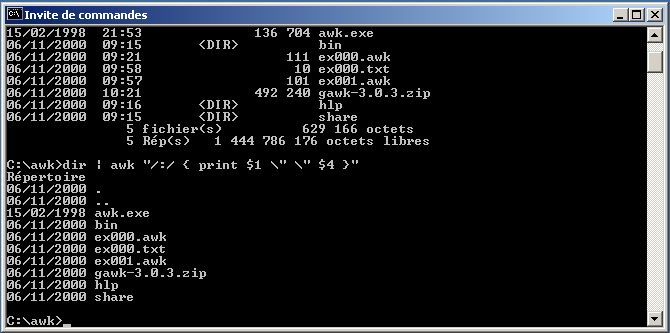
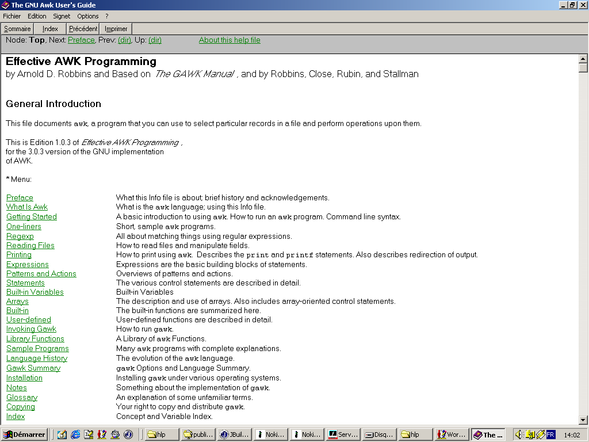
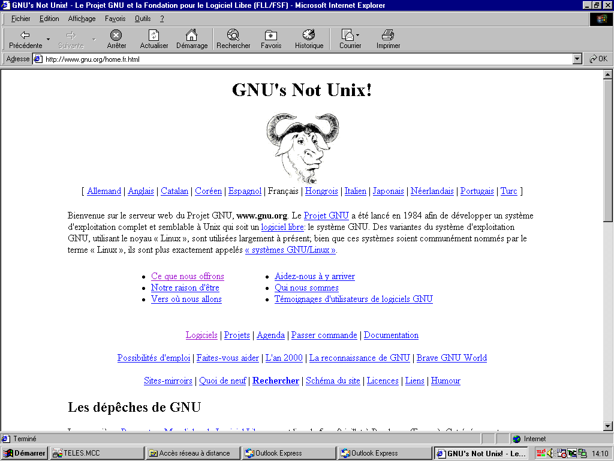
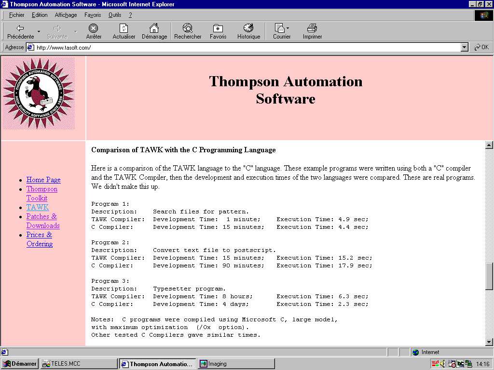

[Article published in *Programmez* magazine, issue #28 (January 2001)](https://www.abandonware-magazines.org/affiche_mag.php?mag=167&num=18774&album=oui)

---

# Awk

*Langage du mois...*

## Aperçu

Les manipulations quotidiennes de fichiers requièrent souvent la programmation de « moulinettes » à usage unique. Les langages de développement nécessitent de nombreuses lignes de code pour ouvrir les flux d'entrée et de sortie, interpréter les données collectées et assurer leur mise en forme. De plus, de tels environnements — en général volumineux — doivent être préalablement installés. L'idéal serait de disposer d'un langage de script, simple à mettre en œuvre, compact et orienté vers la recherche et l'analyse de séquences et d'expressions.

Cette problématique a intéressé des esprits particulièrement brillants. Ainsi Alfred V. Aho (expert ès compilation), Peter J. Weinberger (factorisation des polynômes, ...) et Brian W. Kernighan (à qui l'on doit également le C) se sont intéressés à sa résolution par l'implémentation d'un nouveau langage. Désigné par l'association des initiales de ses concepteurs, la première version d'AWK — sous la forme d'un interpréteur — a donc été finalisée en 1977. L'usage aidant, les spécificités du langage évoluèrent à un rythme soutenu. Les versions se succédèrent ainsi jusqu'en 1985, date à laquelle l'état de l'art fut universellement reconnu comme une norme. Les améliorations les plus significatives portaient alors sur la possibilité de créer des fonctions utilisateurs, sur la gestion de flux multiples et sur la prise en charge des expressions régulières. Largement diffusé dans le monde Unix (intégré à la distribution System V), AWK acquit ses lettres de noblesse lors de l'intégration de ses spécificités à la rubrique « langage de commande et utilitaires » du standard POSIX (en l'occurrence 1003.2).

À l'initiative de Richard Stallman (GNU), une implémentation libre d'AWK (également sous forme interprétée) apparut dès 1986. Elle évolua et continue d'évoluer, au fil de ses contributeurs, par l'adjonction d'améliorations et des mises au point nécessaires. GAWK est disponible pour de nombreux systèmes d'exploitation à partir du site de GNU (http://www.gnu.org). Des variantes commerciales sont également diffusées, en particulier TAWK (http://www.tasoft.com). Particulièrement complète, cette distribution constitue une véritable chaîne de développement (en ligne de commande) permettant la génération d'exécutables natifs DOS, OS/2, Solaris et Windows (avec exploitation des sockets et des DLL).

## En pratique

La réalisation d'un programme AWK s'effectue « à la main », à l'aide d'un éditeur de texte : « notepad » pour Windows ou « vi » pour Unix conviennent parfaitement. Trois blocs fonctionnels sont disponibles (mais non obligatoires) : « BEGIN », « expression régulière » et « END ». Les instructions des blocs « BEGIN » et « END » s'exécutent respectivement au début et à la fin du programme ; celles rattachées à une expression régulière sont exécutées lorsque les conditions requises par celle-ci sont vérifiées.

**ex000.awk**
```awk
BEGIN {
  print "DEBUT"
  CPT=0
}
/A/ {
  CPT++
}
END {
  print "NB DE LIGNE(S) AVEC UN 'A' : " CPT
}
```

L'exemple ci-dessus compte le nombre de lignes contenant un « A ». Son activation s'effectue en ligne de commande à l'aide de la commande `awk -f ex000.awk`. Le message « DEBUT » s'affiche sur la console. Vous pouvez alors saisir quelques lignes de texte, séparées par un retour-chariot, puis, pour terminer le traitement, frapper [CTRL]-Z (touche F6 sous Windows), puis Entrée. L'intérêt d'AWK résidant dans la manipulation de fichiers, la commande peut être complétée par le nom des fichiers concernés.

**ex000.txt**
```
A
B
BA
```

La commande `awk -f ex000.awk ex000.txt` retourne « DEBUT », puis « NB DE LIGNE(S) AVEC UN 'A' : 2 ». La liste des fichiers à traiter peut comporter des jokers, par exemple : `*.bat`.

Les expressions régulières (« /A/ » dans le cas de l'exemple) permettent de limiter l'exécution des instructions concernées aux seules lignes compatibles, c'est-à-dire comprenant la séquence décrite. Les principales règles d'écriture sont les suivantes : « . » (le point) correspond à un caractère quelconque ; « [ABC] » liste les caractères (A ou B ou C) ; « [A-Z] » définit l'ensemble des caractères de A à Z (par exemple) ; « * », « + » et « ? » indiquent respectivement une répétition de 0 à n, de 1 à n, de 0 à 1. La description peut être relative au début de la ligne (préfixée par « ^ ») ou à la fin (postfixée par « $ »).

**ex001.awk**
```awk
/BA*/ { printf "1" }
/A+/ { printf "2" }
/B?/ { printf "3" }
/B[AB]/ { printf "4" }
// { print "" }
```

La commande `awk -f ex001.awk ex000.txt` affiche « 23 », « 13 », « 1234 ». L'expression « // » (qui peut être omise) est vérifiée pour toutes les lignes ; elle est utilisée ici pour sauter une ligne. L'autre intérêt d'AWK consiste en sa faculté de découper la ligne lue (notée `$0`) en champs (`$1` à `$n`) à partir d'un séparateur de champs (par défaut l'espace) et de ligne (par défaut le retour-chariot).

**Windows 2000 seulement**
```
dir | awk "/:/ { print $1 \" \" $4 }"
```

La commande ci-dessus récupère le flux (pipe) issu de la commande `dir` et affiche la date et le nom de chaque fichier (ou répertoire). L'espace est l'opérateur de concaténation. L'autre exemple, adapté au `dir` de Windows 95, permet d'extraire les répertoires.

**Windows 9x seulement**
```
dir | awk "/<REP>/ { print $1 }"
```

Les variables d'AWK ne sont pas typées : leur nature est déterminée par les opérateurs employés. `BEGIN { A="12"; B=35; print A B; print A+B }` affiche « 1235 », puis « 47 ». L'opérateur de concaténation provoque la conversion de B en chaîne. L'addition induit l'interprétation de la valeur de la chaîne A. Les variables peuvent également être exploitées sous forme de tableau, sans déclaration préalable. Les indices sont, au choix, des valeurs numériques ou alphanumériques (voire les deux). La structure `for` dispose même d'une déclinaison spécifique aux tableaux, `for (variant in tableau)`, permettant leur parcours.

**ex003.awk**
```awk
BEGIN {
  split("CECI EST UN TEST",tab," ")
  for (i in tab) {
    print i,tab[i]
    idx[tab[i]]=i
  }
  for (i in idx) {
    print i,idx[i]
  }
}
```

AWK comporte de nombreuses instructions orientées traitement de données. L'une des plus célèbres est `split`, qui restitue sous la forme d'un tableau (`tab`) une chaîne (« CECI ... ») après son découpage à l'aide du séparateur indiqué (l'espace par défaut).

L'absence de typage des variables permet la rédaction de fonctions génériques. `max` retourne la valeur la plus grande, quelle que soit la nature des valeurs. Avec un langage typé, deux fonctions auraient dû être rédigées ; en revanche, l'absence de typage peut produire des résultats assez inattendus. Exemple : `max(100, "34")` retourne... 34 ! Lorsqu'un opérateur de comparaison implique une chaîne, l'ensemble des valeurs comparées sont converties en chaîne, et « 100 » est plus petit que « 34 » (« 1 » précédant « 3 » dans la table ASCII).

**ex004.awk**
```awk
function max(v1,v2) {
  return v1>v2 ? v1 : v2;
}
BEGIN {
  print max("12","34");
  print max(100,34);
}
```

## Révolutionnaire

Novateur, AWK introduit deux notions spécifiques : les expressions régulières et leur gestion événementielle. À l'état « pur » (c'est-à-dire originel, non dérivé), il n'est exploité qu'en complément des interpréteurs de commandes des différents systèmes d'exploitation.

---

**Illustrations**








